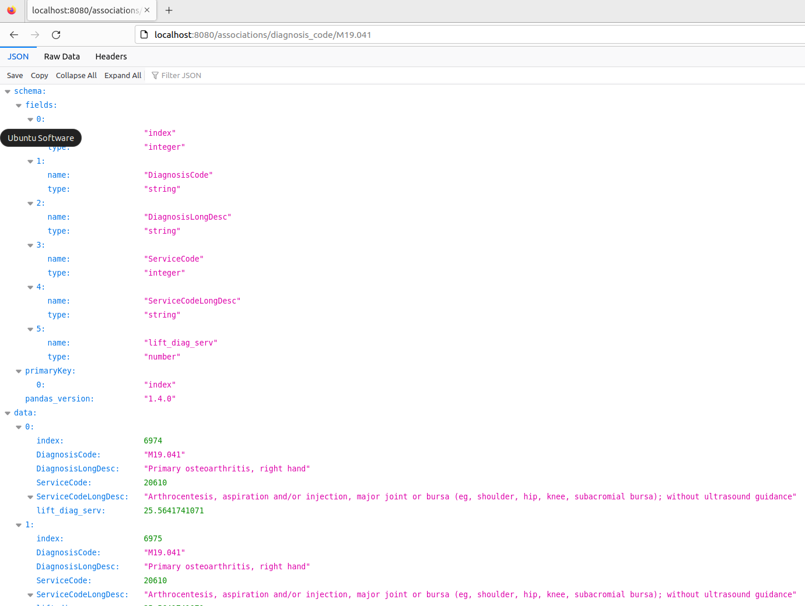
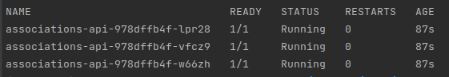
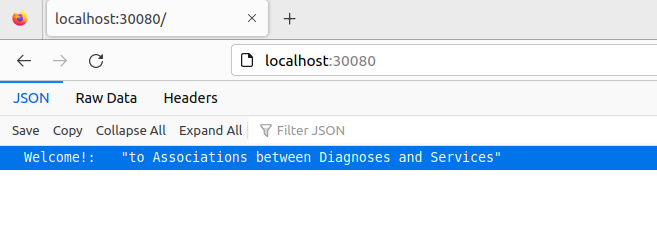
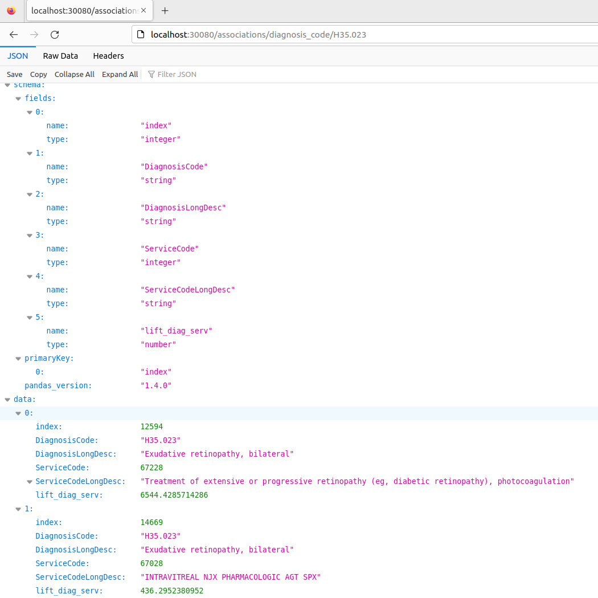
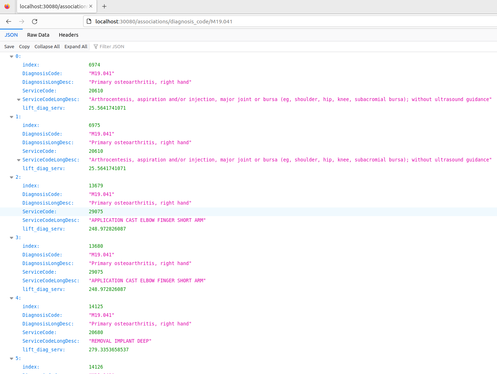

# MACHINE LEARNING MODEL DEPLOYED AS AN API WEB APPLICATION

***

## Description :-

This web application provides an API to access associations between diagnoses and medical services. The data powering 
this web application is at https://github.com/nsb700/association_mining_demo. The API URL allows retrieving associations 
for a diagnosis code. Response is a json for all related services and relevant lift scores.

* API is built using FastAPI - https://fastapi.tiangolo.com/,
* Server used is Uvicorn - https://www.uvicorn.org/,
* Containerization is done using Docker - https://www.docker.com/,
* Container registry used is DockerHub - https://hub.docker.com/ 
* App is deployed using Kubernetes (Minikube)

***

## Setup :-

### (1) Create a virtual environment :- (skip if one of interest already exists)
```commandline
cd ~/
mkdir  my_dir_for_venvs
cd my_dir_for_virtual_envs
python3 -m venv association-mining-webapp-venv
```

### (2) Activate the virtual environment :-
```commandline
source ~/my_dir_for_venvs/association-mining-webapp-venv/bin/activate
```

### (3) Clone this repository :-
```commandline
cd ~/
git clone https://github.com/nsb700/association-mining-webapp.git association-mining-webapp
```

### (4) Install required dependencies by referring to requirements.txt :-
```commandline
cd ~/association-mining-webapp
pip install -r requirements.txt
```

### (5) Install Docker for relevant operating system - https://docs.docker.com/engine/install/

### (6) Install minikube - https://minikube.sigs.k8s.io/docs/start/
Minikube is a local implementation of Kubernetes. The execute the following - 
```commandline
minikube start --driver=docker
```

### (7) Install kubectl for relevant operating system - https://kubernetes.io/docs/tasks/tools/
This allows one to run commands against Kubernetes cluster which in this case is minikube.

### (8) Create account on https://hub.docker.com/ and create a repository.
After creating the repository, one will get the repository name and its push command. 

### (9) Build docker image :-
```commandline
cd ~/association-mining-webapp
docker build -t <repository_name_from_dockerhub>:0.0.1 .

# 0.0.1 just happens to be the tag of our choice.
```

### (10) Push docker image :-
```commandline
cd ~/association-mining-webapp
docker push <repository_name_from_dockerhub>:0.0.1
# This pushed the image to the repository on https://hub.docker.com/
```

### (11) Test web application by running docker image :-
```commandline
docker run -p 8080:80 <repository_name_from_dockerhub>:0.0.1
```
This tells docker to run the container image locally. Here we are telling this command to port forward command from 
our localhost at port 8080 to port 80 of the container.
Go to the browser and enter this URL: http://localhost:8080/associations/diagnosis_code/M19.041
Output is something like this - 


### (12) Create Pods in the Kubernetes cluster:-
```commandline
cd ~/association-mining-webapp/kubernetes
minikube kubectl -- apply -f .
```
Check if pods are generated:
```commandline
minikube kubectl get pods
```


This means that the pods (replicated to 3 instances as per 'replicas' in deployment.yaml), are running.
Each pod is running our container image which is running our web application.  

### (13) Start the web application on any one of our pods :-
```commandline
minikube kubectl port-forward associations-api-978dffb4f-lpr28  30080:80
```
* Here we are telling this command to port forward command from our localhost at port 30080 to port 80 of the service.
* The service will get the request at port 80 and forward the request to the pod at port 80
  (see service.yaml 'port' and 'targetPort'). 
* The pods get the request at port 80 at which it is listening (see deployment.yaml 'containerPort'). 
* The pod then forwards this request to our uvicorn server which is also listening at port 80 (see Dockerfile CMD).

***

## Run the web application :-
* For the sake of simplicity, this app returns all associations (positive and negative). In main.py, it is trivial 
to filter for positive associations (lift > 1)


* Open browser and enter this URL - http://localhost:30080/
* Output should look something like this -



* Now try this URL - http://localhost:30080/associations/diagnosis_code/R03.0
* Output should look something like this -



* Now try this URL - http://localhost:30080/associations/diagnosis_code/M19.041
* Output should look something like this -
